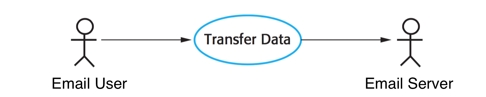
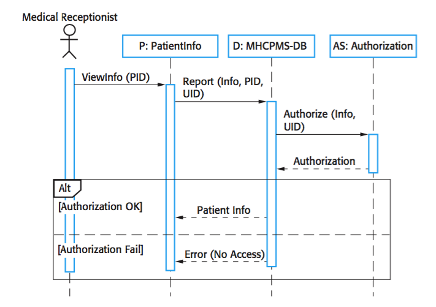

# Journal 4

## by Austin Barrett - Sunday, June 12, 2016 

## Chapter 5 - System Modeling 

​	System Modeling is a way of representing a system at a high-level. This representation is an abstraction of the many parts of a system, and can be composed of several parts. This include but is not limited to Activity, use case, sequence, class, and state diagrams. Because a model is an abstraction of a system it should be devoid of detail. The goal of a model is similar to that of a car show room. It demonstrates what the system looks like and can do, but without explaining how it the internal work. It is believed that five types of UML diagrams can be used to represent the essentials of a system. 

1. ***Activity diagrams***, which show the activities involved in a process or in data processing.
2. ***Use case diagrams***, which show the interactions between a system and its environment.
3. ***Sequence diagrams***, which show interactions between actors and the system and between system components.
4. ***Class diagrams***, which show the object classes in the system and the associations between these classes.
5. ***State diagrams***, which show how the system reacts to internal and external events.

### Context Models 5.1

​	Context model provide an interface / description of the context in a system.Context  is the environment and surrounding element of a system. Context models typically use UML activity  diagrams to lay out the boundaries of a system.

### Interaction Models 5.2

​	All systems are comprised some form of interaction. Whether is be between the users and the system, multiples systems, or the components of the system, this axiom is irrevocable.  Sommerville discuses two methods of modeling interaction, which can be used in conjunction to compliment one another. 

1. Use case modeling, which is mostly used to model interactions between a system and external actors (users or other systems).
2. Sequence diagrams, which are used to model interactions between system components, although external agents may also be included.

#### Use case modeling

Uses chase modeling, as discussed previously in my last journal, is simply a scenario that describes the way in which a user expects to interact with the system. In its most fundamental form, use case models consist of oval(s), and stick figures that represent the actors interaction with the system. (See below)

#### Sequence Diagrams

Sequence diagrams are used to represent the interactions between actors and components in the system, as well as interactions between the components themselves. 

> The objects and actors involved are listed along the top of the diagram, with a dotted line drawn vertically from these. Interactions between objects are indicated by annotated arrows. The rectangle on the dotted lines indicates the lifeline of the object concerned (i.e., the time that object instance is involved in the computation). You read the sequence of interactions from top to bottom. The annotations on the arrows indicate the calls to the objects, their parameters, and the return values. In this example, I also show the notation used to denote alternatives. A box named alt is used with the conditions indicated in square brackets. (Sommerville, p 126)

Sequence diagrams, unless being used to generate code or documentation, should remain simple and do not need incorporate every interaction of the system.

### Structural Model 5.3

​	Structural Models are a graphical representation of the organization of a system. They are used to represent static models of a system, as well as dynamic models. Dynamic models differ from static models in that they show the organization of the system during execution.

#### Class Diagrams

Class diagrams are part of UML. They are used to abstractly represent a class and its relationship to other classes. To represent a class simply draw a rectangle  and place the name of the class inside. Relationships are then represented by drawing a line between classes. Placing a '1' on the line next to the class, denoting a one to one relationship, however you can also represent a one to many relation by following the '1' with a '..*'. Further these relationships can be label to provide more insight as to what the relationship is.

Example:

​													Figure 5.3.1

More detail can be give to the classes by extending the rectangle. At the top of the rectangle is the name of the class / object. The following section in made up attributes, which in OOP are referred to as fields and properties. Finally, the last section is filled with operations, commonly known as methods in OOP.

​													Figure 5.3.2
 

| Property Symbol | Meaning   |
| --------------- | --------- |
| -               | Private   |
| +               | Public    |
| #               | Protected |
| Etc             | Etc       |

#### Generalization

Generalization is used to simplify classes so that extreme and repetitive detail is not provide. Generalization works similarly to inheritance, in that there is a top most class that contains attributes and operations the can be applied to subclasses. Example all animals eat, sleep, and move, but not all animals bark; ergo a dog inherits the afore mentions attributes and operations, but itself adds the operation of barking. 

Generalization is represented as a tree with the most generic attributes and operations at the root (parent class) of the tree, and classes with greater specificity as branches. Just as before the classes in the hierarchy can display greater detail other than the position and name. This is done the same way as in Figure 5.3.1.

#### Aggregation

> Objects in the real world are often composed of different parts. For example, a study pack for a course may be composed of a book, PowerPoint slides, quizzes, and recommendations for further reading. Sometimes in a system model, you need to illustrate this. The UML provides a special type of association between classes called aggregation that means that one object (the whole) is composed of other objects (the parts). To show this, we use a diamond shape next to the class that represents the whole. This is shown in Figure 5.13, which shows that a patient record is a composition of Patient and an indefinite number of Consultations. (Sommerville, p 133)

### Behavioral Models 5.4

"Behavioral models are models of the dynamic behavior of the system as it is executing." (Sommerville, p 133) They show the systems reaction to certain thing.

​	1. ***Data***  - data arrives that has to be processed by the system.
​	2. ***Events*** - an event triggers system processing. Events may sometimes  have data.

Most system in business are data-driven, and have very few events to watch / listen for. 

#### Data-driven Modeling

Data-driven models show how data is processed from an input, and it associated output. These models can be generated using DFDs (Data Flow Diagrams). These diagrams are useful for documenting, and validating process; and allow for user to early do so. However, DFDs are not recognized in UML, because they are unable to represent objects. Though UML uses Activity Diagrams to make up for this. The same thing can also be achieved with sequence diagrams.

#### Event-driven Modeling

Event-driven modeling shows how a system responds to events, and is based on the idea that a system has a finite number of states. These models are represented using state diagrams which can be thought of as finite state machines. State diagrams only show the transition of events, and don't given ideas as to how data flows. "In UML state diagrams, rounded rectangles represent system states. They may include a brief description … of the actions taken in that state. The labeled arrows represent stimuli that force a transition from one state to another. You can indicate start and end states using filled circles, as in activity diagrams." (Sommerville, p 137)

### Model-driven Engineering

Model-driven Engineering (MDE) is the idea that models are the ultimate result of development instead of programs. The argument for this is that using MDE an engineer does not need to focus on the specifics of a programming language but instead can focus on the system itself. Once a model is complete it only needs to be run through a translator, which allows the model to be reusable and platform independent. 

#### Model-driven architecture

Model-driven architecture (MDA) is focused on software design and implementation based on a  subset of UML models. MDA is made up three types of models

1. ***Computation Independent Model (CIM)*** which models the important domain abstractions used in the system. Simply put CIM is a way of representing a view of the system.
2. ***Platform Independent Model (PIM)*** which models the operation of the system without reference to its implementation. PIM usually describes models that show the system structure and how it reacts to events.
3. ***Platform Specific Models (PSM)*** which are transformations of the platform independent model with a separate PSM for each application platform. 

PSMs are passed to a translator to generate executable code, which in theory is platform independent. Currently there exists no CIM to PIM translators and probably won't be for the foreseeable future. However there exist a handful of commercially available PIM to PSM translators. These translator still have tools that limit usability. For example some platform use different specifications for generating GUI, so it will require interaction with a person to complete translation.

#### Executable UML

The driving idea behind MDE is that a model should be able to be converted to executable code. To help do this Executable UML (xUML) was created. xUML adds more specifications to the UML that remove ambiguous models like use case diagrams from the compilation and development process.