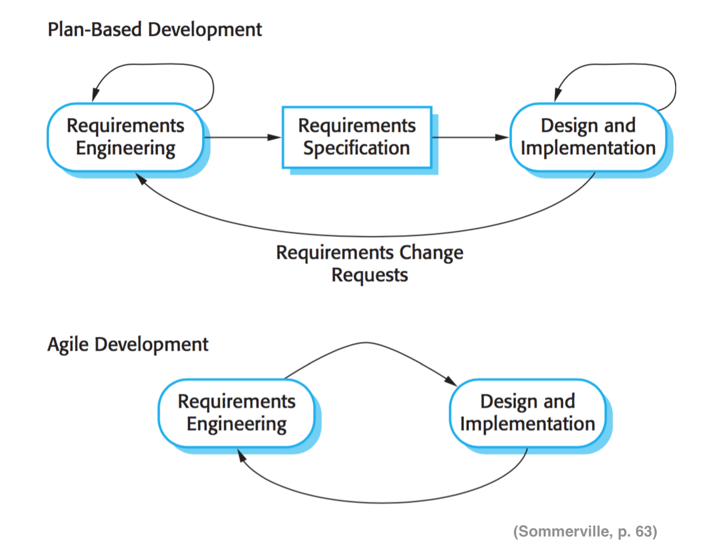
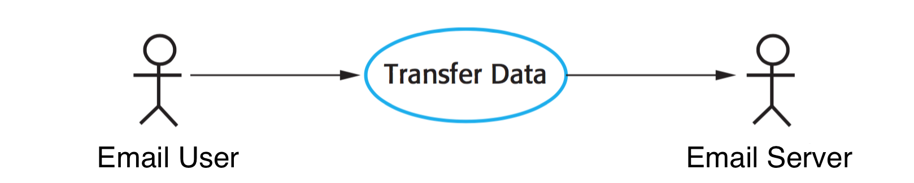
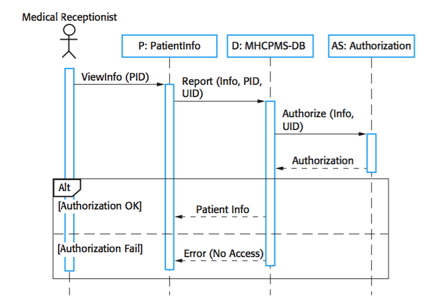
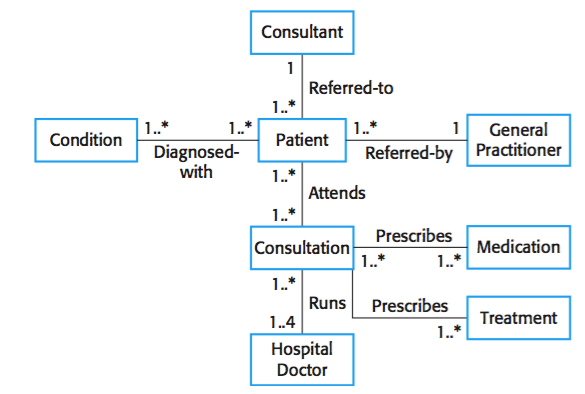
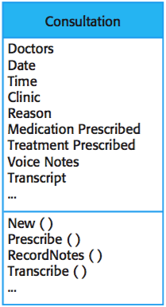
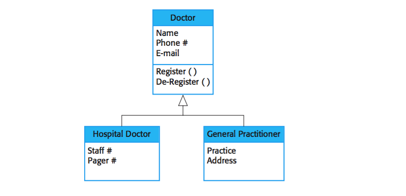

#Journal 1

## BY Austin Barrett Monday, May 23, 2016  

##Chapter 1

###**Professional Software Development**

​     Software engineering, what is it? Ian Sommerville, author of Software Engineering 9th Edition, defines software engineering as "an engineering discipline that is concerned with all aspects of software production." (p. 6) Simply put software engineering is the reallife practical applications of Computer Science.

These application can be broken down into eight major types.

1. Standalone applications
2. Interactive transaction based applications
3. Embedded control systems
4. Batch processing systems
5. Entertainment systems
6. Systems for modeling and simulation
7. Data collection systems
8. Systems of systems

As an  engineer, one must be able to select the appropriate application type. Each application type has different requirements that will effect the programming languages needed to complete software. 

Example

> A airplane manufactorer needs a new braking system that is able to deploy the brakes within a drastically short period.

Given this requirement, it would seem quite inapropriate to use an interprated language like python or ruby to build the embedded control system for the brakes, instead it would be more logical to use a lower level language like c or assembly, because the languages are compiled and don't need to be interprated on the fly. Other consideration for this project are what development style used. When developing such a system the developers need to, as the old adage says, measure twice cut once. Continous deployment or Increamental development would not be appropriate, because the they take an infeild aproach to testing that promotes a fail fast and often attitude to working out bugs. Which is never a good idea when failing fast could mean killing many.

###**Software Engineering Ethics**

     As software engineers do what they do best, they must think about the possible uses, and application of the technologies involved. 

Example I  

> A banking firm decides to contract a software development team to build a mobile application to allow its patrons to be able to facilitate their banking transaction. The team that will be developing this software will have to take into consideration that they will be in possession of sensative information, access to restricted systems, as well as possiblilty that there software could be compromised.

Moreover, a developer must be able to express to their employer what they are comfortable with doing. Some developers may have some qualms with what is being asked of them, and therefore should be able to advocate for their position.

Example II

>A development team is approached by the government to build missle guidance system. However one of the team members is anti-war, therefore morallly and ethically objects to building the software. 

This developer must be able to communicate their inability to work on the project with their team, and potential employer. Communication of the developers opinions is important because it could their opinions could effect the team later down the line.

## Chapter 2

​     Software processes are a collection of related activities that aid in the production of software. These activaties may include build a software from scratch or by use third party off the self software to integrate with a new application. Sommerville outline four activaties that are usaully part of the a software process.

|          Software specification          |    Software design and implementation    |           Software validation            |            Software evolution            |
| :--------------------------------------: | :--------------------------------------: | :--------------------------------------: | :--------------------------------------: |
| The functionality of the software and constraints on its operation must be defined. | The software to meet the specification must be produced. | The software must be validated to ensure that it does what the customer wants. | The software must evolve to meet changing customer needs. |

Software Process have the ablity to scale to greater complexities, and therefore need acompanying techniques and tools.

### **Software Process Models & Process Activities**

​     Simply put Software Process Models are representations used to describe, convey, or demostrate a sowftware process. in this chapter Sommerville discusses three different Software Process Models.

1. ***The waterfall model*** - This approach to SPM (Software Process Model[ing]) represents the above activaties a procedural steps, in which each successive step is directly depend on its predecessor.
2. ***Incremental development*** - This SPM combines specification, design and implementation, and validation into one step. Once completed the fourth tenet ( Evolution ) begins, and the funtionallity is added to the software interatively.
3. ***Reuse-oriented software engineering*** - This model requires of the software the ability to be modular, sticking functionality it reusable and change parts. The primary focus of this model is integration with third party software and services.

As demostrated by incrementative development these activaties can become interwoven with each other. With this occurs it adds a certain amount of complexity to the overall software process. To aid in the furtherment of the software process there have been sveral tecniques and developed. Moreover, the scope of these activaties can extended far beyond the developer(s), requiring interaction with manajerial staff, and clients / users. Being a technical, and collaborative process tools play an exceptionally large role. From tracking changes to keeping a team on track, and much more, tools have completely redefined what the modern software developer and software can do.

### **Coping With Change**

​     As business, and technology change so must the software developers create, and the techniques they use to create them. The problem with change is it has an impact on many aspects of the product. Changing with requirements or the market can be costly. Developer have to rework code which takes time, and as the saying goes time is money. Also implementing new technology can have many other adverse monetary effects, such as licensing, data model restructuring, hardware complience, etc. However the converse is true as well. Some changes can increase profit or decrease lost. Example decreasing the upstart time of an application, or decreasing the time for a transation has a long term value and can also add to the brand. Upgrading hardware can also have an dramatic impact on lost. Example it is cheaper to buy 4GB of RAM than 2GB, or upgrading your AWS (Amazon Web Services) EC2 (Elastic Cloud Compute) instances to a newer hypervisor can cut a bill in as much as half. 

Never the less,change will happen and the are many tools and techniques the can help ease the transition.

### **The Rational Unified Process**

The Rational Unified Process (RUP) was created by rational, a software company that was aquired by IBM in 2003. Originally RUP was developed as a SPM program / framework designed to streamline development while giving it the ridged structure used by Rational. However, since the software's inception it has grown into a full fledged SPM compairable to the Waterfall Model.
# Journal # 2

## by Austin Barrett - Sunday, June 5, 2016 

## Chapter 3	

### 3.1 Agile Methods

​	In the early days of software development their existed a large focus on Software Engineering Processes, most of which did not scale well. These processes worked great for large companies and certain forms of software development. However they have their pitfalls. Processes driven by a need for documenting, lackadaisical communication, and changes in negotiations as well as specifications. To tackle these issues a group of developers in the 1990s form to create the ***agile manifesto*** , which states:

> We are uncovering better ways of developing software by doing it and helping others do it. Through this work we have come to value:
> - Individuals and interactions over processes and tools
> - Working software over comprehensive documentation
> - Customer collaboration instead of quibbling over contract negotiation
> - Responding to change over following a plan
>
> That is, while there is value in the items on the right, we value the items on the left more.

This manifesto was later adopted and used to craft new methodologies and processes for software development. Agile methods have a great focus on incremental development as oppossed the formal / classical approach to development which required the delivery in full. As mentioned before, this type of development can be problematic due to the ever changing requirements expierenced in common software development. 

### 3.2 Plan-driven and agile development

​	Much of agile and plan driven development differ from each other, however, they do share one key facet, they utilize incremental cycles. (See figure 3.2)

***Figure 3.2 :***

Agile is vision/value driven development, as opposed to traditional development which is plan driven. By being focused on the vision / value of a project development becomes more fluid, allowing for features to be the scope of a project, not a requirements.

Sommerville provides a list of question to ask when deciding on a development process. The questions are as follows:

1. Is it important to have a very detailed specification and design before moving to implementation? If so, you probably need to use a plan-driven approach.
2. Is an incremental delivery strategy, where you deliver the software to customers and get rapid feedback from them, realistic? If so, consider using agile methods.
3. How large is the system that is being developed? Agile methods are most effective when the system can be developed with a small co-located team who can communicate informally. This may not be possible for large systems that require larger development teams so a plan-driven approach may have to be used.
4. What type of system is being developed? Systems that require a lot of analysis before implementation (e.g., real-time system with complex timing requirements) usually need a fairly detailed design to carry out this analysis. A plan- driven approach may be best in those circumstances.
5. What is the expected system lifetime? Long-lifetime systems may require more design documentation to communicate the original intentions of the system developers to the support team. However, supporters of agile methods rightly argue that documentation is frequently not kept up to date and it is not of much use for long-term system maintenance.
6. What technologies are available to support system development? Agile methods often rely on good tools to keep track of an evolving design. If you are developing a system using an IDE that does not have good tools for program visualization and analysis, then more design documentation may be required.
7. How is the development team organized? If the development team is distributed or if part of the development is being outsourced, then you may need to develop design documents to communicate across the development teams. You may need to plan in advance what these are.
8. Are there cultural issues that may affect the system development? Traditional engineering organizations have a culture of plan-based development, as this is the norm in engineering. This usually requires extensive design documentation, rather than the informal knowledge used in agile processes.
9. How good are the designers and programmers in the development team? It is sometimes argued that agile methods require higher skill levels than plan-based approaches in which programmers simply translate a detailed design into code. If you have a team with relatively low skill levels, you may need to use the best people to develop the design, with others responsible for programming.philosophies
10. Is the system subject to external regulation? If a system has to be approved by an external regulator (e.g., the Federal Aviation Authority [FAA] approve software that is critical to the operation of an aircraft) then you will probably be required to produce detailed documentation as part of the system safety case.

Overall the importance of assigning a label to your software development process is nil. Modern companies and development teams tend to use a hybrid of the two, taking aspects of agile and applying them to plan driven development.

### 3.3 Extreme Programming

​	Extreme Programming (XP) as its name suggests is a method of agile programing in which emphasis on good practices are pushed to the extreme. XP embraces many of the philosophies of agile. However XP is really best suited for small to medium teams, and can be quite costly, causing it to be used only for short projects. 

There are serval very important aspects to XP. They can be distilled down into two main parts testing, and pair programming.

#### Testing in XP

By testing first and often bugs can be detected easily and early. Most testing in XP is done so through Unit Tests in which code is broken into the smallest possible modules. Once tested the code can then be refactored, making code clean and easy to maintain. Once a unit is complete it is added to the overall project, and then tested all side the rest of the software. This is know as continuous integration. Programming in this fashion allows for small incremental releases. Once complete the release under goes a code review.

#### Pair Programming

Code review is the process in which a group of developers and associated team members gather to critique, improve, and understand the new code and its place in the system. In XP code review happens in teams and helps reenforce collective ownership. Collective ownership occurs because programming is done in pairs, and each member of the pair is responsible for understanding the code as it applies to the system, as well as the codes failure, thus removing the stigma of failure from the individual.

### 3.4 Agile project management

​	Scaling agile processes to large systems and projects is extremely difficult. Systems at this scale require design and some documentation at the beginning of the project before modules can be built. Without this, it can be functionally impossible to make real progress or even begin. Continuous integration is nearly impossible when multiple separate teams are working on a project.  It becomes impractical to rebuild systems every time a new change in committed to the project. Further, these modules could be incompatible with the system, as teams are not privy to the system.

# Journal 3

## by Austin Barrett - Sunday, June 12, 2016

## Chapter 4 Requirements Engineering

​	Requirements for a system describe what the system should do, what services it provides, and constrains its operations. Requirements reflect the needs a customers has for a system  serving a certain purpose. Requirements Engineering (RE) is the process of  analyzing, documenting, and checking system services and constraints.

### Functional and non-functional requirements 4.1

​	Functional requirements describe what the system should do. Requirements are dependent on the type of software being developed, the intended users, and the way in which the client wrote the requirements. Sometimes functional requirements are written as abstract user requirements only understood by system users. However, functional requirements can describe the system's functionality in greater detail. Put simply functional requirements are those which define features, whereas non-functional requirements define qualities of the system.

Non-functional requirements can impact the entire system instead of a single component. Non-functional requirements can be further broken down into three sub-type requirements.

| Name                        | Definition                               | Example                                  |
| --------------------------- | ---------------------------------------- | ---------------------------------------- |
| Product requirements        | These requirements specify or constrain the behavior of the software. | Performance, memory, reliability, acceptable failure rates, security, and usability requirements. |
| Organizational requirements | These requirements are defined by vague system requirements derived from the organizations, or developer's culture | Operational process requirements, development process requirements, development environment or process standards. |
| External requirements       | Requirements that are derived from factors external to the system and its development process. | Regulatory requirements                  |

### The software requirements document 4.2

​	A software requirement document in its simplest and most distilled form is a list of requirements for a project. However software requirement documents can be quite large depending on the type of project. Given a project that requires interaction with a PLC or MCU, or even a sensitive data set, requirements documents become very important. To contrast projects like video games act more like a live being, growing, evolving, and ever changing, ergo they need less strict and detailed requirement document(s). In most modern day projects thing change to fast to crank out new requirement document(s), instead methodologies the reside in the agile camp, use things like cards, list, and boards to add to the requirements, but as features.

### Requirements specification 4.3															

​	Requirement Specification is the process of creating a requirement document. Ideally specifications, whether for users or the system, should be clear, concise, and easy to read. 

#### User and System Requirements

User requirements should define the functional and non-functional requirements for a system without requiring the user to have technical knowledge. This means that the document should be devoid of industry jargon, models, and other industry isms. Instead user requirements should be written in plain everyday language. However this can be troublesome. Much like reading the bible, people will and do interpret the meaning differently, which can then lead to confusion amongst those involved.

System Requirements are an elaboration on the user requirements, but with a great deal more detail. System requirements serve as a starting point for developers to begin designing and implementing the system. They also provide a description of how user requirements should be delivered. Just like user requirements, system requirements should specify the externals of a system, and leave the design and implementation of the system up to the developer(s). However this is a complicated feat for more involved, and feature rich systems, as they require a much higher level of detail. 

#### Natural language specification

Natural language specification is specification through common language. However, because of region, and background words and phrases used in  natural language specifications can have different meanings, and therefore cause misunderstanding. To help mitigate these issues Sommervile recommends the following.

1. Define a standard for the requirement documentation. This includes format, style, syntax, etc..
2. Use consistent language to distinguish between mandatory and optional requirements. 
3. Use typographical cues i.e. bolding, italicizing, and underlining.
4. Do not assume that readers understand technical software engineering language. Define possibly unknown terms, or better yet leave out the jargon.
5. Give context and meaning to requirements.

#### Structured specifications

Structured natural language specifications are more rigid and limited forms of natural language specifications but with a given structure. The structure is usually derived from an agreed upon template. Using a structured specification streamlines parts of the requirement specification, and makes for a more clear meaning, relying less on the users interpretation. However this can still have its problems, especially in the case of complex computations.

### Requirements elicitation and analysis 4.5

​	After an initial feasibility study, the next stage of the requirements engineering process  (REP) is requirements elicitation and analysis. During this activity, developers work with customers / users to determine the scope of the system, the services it should provide, the required performance / hardware constraints, etc. More simply, the developer gather requirements from the customer and users.

Generally, there are four activities used in the REP. They are as follows:

1. *requirement discovery* collaboration with stakeholders and other system users to gather requirements.
2. *requirement classification in organization* as its name clearly states it is the process of organizing and classifying requirements.
3. *requirements prioritization and negotiation* the process of distilling requirements and features to their most rational and functional form. This is done because stakeholders requirements have the potential to conflict.
4. *requirements specification* the collected requirements are documented. As discussed in the previous section these documents can be simple two extremely formal.

#### Interviews

During requirement elicitation it is commonplace to hold interviews with stakeholders. Interviews happened in one of two ways, closed interviews in which the interviewer asks the interviewee a predefined set of questions, or open interview where in nothing is predefined. Both methods are generally used in conjunction, because because neither technique alone yields 100% useful information. Though interviews are useful for gathering user-based requirements is harder to elicit system domain requirements from this process. The router these complications can be simply derived from the interviewees comfort with the domain, or the general culture/understanding of the domain. Effective interviewers are able to mitigate these issues and derive usable requirements from the interviews.

#### Scenarios

In lieu of doing an interview software engineers can provide the stakeholders with one for more scenarios. Doing so helps the stakeholders and division interactions with the system and convey likes and dislikes, as well as further requirements and unneeded requirements.

In general scenarios will include:

1. A description of what the system and users expects when the scenario starts
2. A description of the normal flow of events in the scenario.
3. A description of what can go wrong and how this is handled.
4. Information about other activities that might be going on at the same time.
5. A description of the system state when the scenario finishes.

#### Use cases

Use cases in their simplest form are used to describe the actors and interactions of the system. Use cases are a large part of the object oriented method and are used in UML. Use cases are visual representations that describe interactions between users in the system, comprised of stick figures and textual annotations. Scenarios and use cases are the most effective forms of eliciting requirements from stakeholders.

#### Ethnography

Ethnography is a form of requirement eliciting that requires the developer to embed themselves in the workplace for which the system is being built. More simply, ethnography is the observation of stakeholders, there work, and environment to derive requirements. Because of its focus on the user, ethnography have trouble identifying system in domain requirements.

### Requirements Validation 4.6

Requirements validation is used to determine the validity of requirements before they are implemented. This is done to ensure that the requirements specified meet the description of the desired system. If this process is skipped future May arise, which can be costly as it requires retool and in retesting. During requirement validation several different types of checks should be completed. Validation check should occur to make sure that user features/requirements are necessary and do not conflict other features/requirements. A consistency check ensures that documented requirements do not conflict. Completeness checks ensure that all functions are defined and so are their constraints.	Realism checks are used to guarantee the feasibility of a system, this is done so by looking at current technology. Verifiability it's a key aspect every climate validation. It is used to ensure that the contractor and the customer are in agreement with any and all documented requirements.

### Requirements Management 4.7

​	Managing requirements can be exceptionally hard to do and large systems. The reason for this is because some problems are too complex to easily define. Other issues may arise such as environmental changes, hardware changes an introduction of new business practices; a disconnect between the people pain and the people using the system; and diverse city amongst end-users and their expectations

#### Requirement Management Planning

During the initial phases of RE it is important to design a plan for managing requirements and their future possible changes. This can be achieved by using several requirement management planning techniques as requirement identification,  a change management process, traceability policies, and tool support.

#### Requirements Change Management

Requirement change management is used after the requirement document has been approved. When changes are proposed the process to ensure that the requirements stay complete, coherent, and copacetic. The three fundamental stages of the change management process our as follows:

1. *Problem analysis and change specification* - problem or a new requirement is identified, and a proposal for a new requirement for change is made.
2. *Change analysis and costing* - during the stage an analysis of the effects of the proposed change for new requirement is completed. This is done to ensure the feasibility, and cost-effectiveness of the proposed change.
3. *Change implementation* - after approval the change is implemented into the requirements document and where ever else necessary.

# Journal 4

## by Austin Barrett - Sunday, June 12, 2016 

## Chapter 5 - System Modeling 

​	System Modeling is a way of representing a system at a high-level. This representation is an abstraction of the many parts of a system, and can be composed of several parts. This include but is not limited to Activity, use case, sequence, class, and state diagrams. Because a model is an abstraction of a system it should be devoid of detail. The goal of a model is similar to that of a car show room. It demonstrates what the system looks like and can do, but without explaining how it the internal work. It is believed that five types of UML diagrams can be used to represent the essentials of a system. 

1. ***Activity diagrams***, which show the activities involved in a process or in data processing.
2. ***Use case diagrams***, which show the interactions between a system and its environment.
3. ***Sequence diagrams***, which show interactions between actors and the system and between system components.
4. ***Class diagrams***, which show the object classes in the system and the associations between these classes.
5. ***State diagrams***, which show how the system reacts to internal and external events.

### Context Models 5.1

​	Context model provide an interface / description of the context in a system.Context  is the environment and surrounding element of a system. Context models typically use UML activity  diagrams to lay out the boundaries of a system.

### Interaction Models 5.2

​	All systems are comprised some form of interaction. Whether is be between the users and the system, multiples systems, or the components of the system, this axiom is irrevocable.  Sommerville discuses two methods of modeling interaction, which can be used in conjunction to compliment one another. 

1. Use case modeling, which is mostly used to model interactions between a system and external actors (users or other systems).
2. Sequence diagrams, which are used to model interactions between system components, although external agents may also be included.

#### Use case modeling

Uses chase modeling, as discussed previously in my last journal, is simply a scenario that describes the way in which a user expects to interact with the system. In its most fundamental form, use case models consist of oval(s), and stick figures that represent the actors interaction with the system. (See below)

#### Sequence Diagrams

Sequence diagrams are used to represent the interactions between actors and components in the system, as well as interactions between the components themselves. 

> The objects and actors involved are listed along the top of the diagram, with a dotted line drawn vertically from these. Interactions between objects are indicated by annotated arrows. The rectangle on the dotted lines indicates the lifeline of the object concerned (i.e., the time that object instance is involved in the computation). You read the sequence of interactions from top to bottom. The annotations on the arrows indicate the calls to the objects, their parameters, and the return values. In this example, I also show the notation used to denote alternatives. A box named alt is used with the conditions indicated in square brackets. (Sommerville, p 126)

Sequence diagrams, unless being used to generate code or documentation, should remain simple and do not need incorporate every interaction of the system.

### Structural Model 5.3

​	Structural Models are a graphical representation of the organization of a system. They are used to represent static models of a system, as well as dynamic models. Dynamic models differ from static models in that they show the organization of the system during execution.

#### Class Diagrams

Class diagrams are part of UML. They are used to abstractly represent a class and its relationship to other classes. To represent a class simply draw a rectangle  and place the name of the class inside. Relationships are then represented by drawing a line between classes. Placing a '1' on the line next to the class, denoting a one to one relationship, however you can also represent a one to many relation by following the '1' with a '..*'. Further these relationships can be label to provide more insight as to what the relationship is.

Example:

​													Figure 5.3.1

More detail can be give to the classes by extending the rectangle. At the top of the rectangle is the name of the class / object. The following section in made up attributes, which in OOP are referred to as fields and properties. Finally, the last section is filled with operations, commonly known as methods in OOP.

​													Figure 5.3.2
 

| Property Symbol | Meaning   |
| --------------- | --------- |
| -               | Private   |
| +               | Public    |
| #               | Protected |
| Etc             | Etc       |

#### Generalization

Generalization is used to simplify classes so that extreme and repetitive detail is not provide. Generalization works similarly to inheritance, in that there is a top most class that contains attributes and operations the can be applied to subclasses. Example all animals eat, sleep, and move, but not all animals bark; ergo a dog inherits the afore mentions attributes and operations, but itself adds the operation of barking. 

Generalization is represented as a tree with the most generic attributes and operations at the root (parent class) of the tree, and classes with greater specificity as branches. Just as before the classes in the hierarchy can display greater detail other than the position and name. This is done the same way as in Figure 5.3.1.

#### Aggregation

> Objects in the real world are often composed of different parts. For example, a study pack for a course may be composed of a book, PowerPoint slides, quizzes, and recommendations for further reading. Sometimes in a system model, you need to illustrate this. The UML provides a special type of association between classes called aggregation that means that one object (the whole) is composed of other objects (the parts). To show this, we use a diamond shape next to the class that represents the whole. This is shown in Figure 5.13, which shows that a patient record is a composition of Patient and an indefinite number of Consultations. (Sommerville, p 133)

### Behavioral Models 5.4

"Behavioral models are models of the dynamic behavior of the system as it is executing." (Sommerville, p 133) They show the systems reaction to certain thing.

​	1. ***Data***  - data arrives that has to be processed by the system.
​	2. ***Events*** - an event triggers system processing. Events may sometimes  have data.

Most system in business are data-driven, and have very few events to watch / listen for. 

#### Data-driven Modeling

Data-driven models show how data is processed from an input, and it associated output. These models can be generated using DFDs (Data Flow Diagrams). These diagrams are useful for documenting, and validating process; and allow for user to early do so. However, DFDs are not recognized in UML, because they are unable to represent objects. Though UML uses Activity Diagrams to make up for this. The same thing can also be achieved with sequence diagrams.

#### Event-driven Modeling

Event-driven modeling shows how a system responds to events, and is based on the idea that a system has a finite number of states. These models are represented using state diagrams which can be thought of as finite state machines. State diagrams only show the transition of events, and don't given ideas as to how data flows. "In UML state diagrams, rounded rectangles represent system states. They may include a brief description … of the actions taken in that state. The labeled arrows represent stimuli that force a transition from one state to another. You can indicate start and end states using filled circles, as in activity diagrams." (Sommerville, p 137)

### Model-driven Engineering

Model-driven Engineering (MDE) is the idea that models are the ultimate result of development instead of programs. The argument for this is that using MDE an engineer does not need to focus on the specifics of a programming language but instead can focus on the system itself. Once a model is complete it only needs to be run through a translator, which allows the model to be reusable and platform independent. 

#### Model-driven architecture

Model-driven architecture (MDA) is focused on software design and implementation based on a  subset of UML models. MDA is made up three types of models

1. ***Computation Independent Model (CIM)*** which models the important domain abstractions used in the system. Simply put CIM is a way of representing a view of the system.
2. ***Platform Independent Model (PIM)*** which models the operation of the system without reference to its implementation. PIM usually describes models that show the system structure and how it reacts to events.
3. ***Platform Specific Models (PSM)*** which are transformations of the platform independent model with a separate PSM for each application platform. 

PSMs are passed to a translator to generate executable code, which in theory is platform independent. Currently there exists no CIM to PIM translators and probably won't be for the foreseeable future. However there exist a handful of commercially available PIM to PSM translators. These translator still have tools that limit usability. For example some platform use different specifications for generating GUI, so it will require interaction with a person to complete translation.

#### Executable UML

The driving idea behind MDE is that a model should be able to be converted to executable code. To help do this Executable UML (xUML) was created. xUML adds more specifications to the UML that remove ambiguous models like use case diagrams from the compilation and development process.# Journal 5

## by Austin Barrett - Sunday, July 17, 2016  

## Chapter 6 - Architectural Design 

​	Architectural Design is the first step in software in the software design process, & bridges the gap between design , & requirements engineering. Explicitly defining architectural designs , & documentation has several advantages.

1. Stakeholder communication becomes easier when present, as they help facilitate communicate , & understanding.
2. System Analysis during architectural design aids in determining the feasibility of a system.
3. Large-scale Reuse — some systems have similar requirements , & therefore can be reused in other systems.

### 6.1 Architectural Design Decisions

​	Architectural Design Decisions can be thought of as a collection of decisions, based on the architect's  experience. These decision lead to a contractual design for a given software project. These architectural design decisions aRequirements Engineering based on architectural patterns / styles that can be reused. While making these decisions, the architect must consider performance, security, safety, availability, & maintainability.

### 6.2 Architectural Views

​	Architectural views are used to represent different facets of a system's architecture. It is impossible to represent every part of an architecture in a single architectural view. The 4+1 model provides a generic way to represent multiple views of a system. In the 4+1 model, it is suggested that there are four fundamental views of a software architecture. 

1. Logical View
2. Process View
3. Development View
4. Physical View 

It has been suggested that there should be a 5th view called the Conceptual view, which provides a high level view of the system. This view can aid in bridging the gap between the the customer, end user, & the architect.

Depending on the development methodology employed by the software development team, these views can be represented in UML. This is less true in agile development which focus less on documentation.

### 6.3 Architectural Patterns (Styles)

​	Architectural  Patterns are stylized, abstract descriptions of best practices for  system architecture. Examples of architectural patterns are layered, repository, client/server, & pipe/filter architecture.

#### Layered architecture 

In this architectural pattern, each functional competent can operate as a layered in the system. This pattern makes supporting incremental development significantly easier. Because each layer of the system works nearly independently, & only effects the adjacent layer. 

These concepts can be seen in the commonly used MVC model. I utilize the MVC model in my a LEAN (Level Express Angular Node) application. In this model there are three main layers, the model, the view, & the controller.

#### Repository architecture

This pattern is just a small foot note in Sommerville's writing & therefore will be will be excruciatingly brief. Repository architecture is simply a pattern in which data is shared between components & software. At fundamental level this is how VCS (Version Control System) works. A common set of code is shared between many devices, with every change being stored as a previous version.

#### Client / Server Architecture 

In this architectural pattern two or more pieces of software communicate usually over a network protocol. In this model the softwares tend to be distributed. Each software component should be independent of each other & therefore easier to maintain.

Being a full stack application, the client server model is implied. My application acts as a server, & when a browser connected to the application it becomes a client.

#### Pipe/Filter architecture

Pipe/Filter architecture is named after unix pipes, & derive their general functionality from said unix pipes. Data flows from one function to another, with output of the original function being passed into the next function. The functions manipulate, & filter the output until it reaches its final state. 

This pattern can be seen in my application. Javascript, which is the main language used in my application, is implemented as a functional language, following the pipe/filter model.

### Application Architecture 

​	An application architecture is a generic way to create an application. These architectures are highly re-usable ways to write an application. Though not every application has the same functionality, it can follow a similar pattern. 

## Chapter 7

​	Software design & implementation is a  set of activities that start off the programming process. This is the phase in which the basic logic is worked out. The granularity of the design depends on the system being developed, & the methodology used to develop it. 

### 7.1 Object Oriented Design using The UML

​	Object-oriented design is the approach to software development in which data is strutted as real world objects & are defined by their classes. The data contained in objects is considered private. The core of OOP is the relationships that exist between objects. 

When working in OO it is common to use UML (Unified Modeling Language) to represent the many facets of OO. However it is this developers opinion that UML is a excessively verbose, & therefore pointless, hence the absence of it from the developed application.

Many developers utilize UML to nail down the general logic of a system, as well as the scope, constraints, & design. This is done so through different types of models & diagrams.

### 7.2 Design Patterns

​	Design Patterns are general solutions to common problems. These patterns are vague in nature, & are only to be consider as a framework not a full solution. These design patterns are most commonly seen in OO design & rely great on the four pillars of OO design. 

Design Patterns are highly reusable, as their name suggests. They provide a high-level overview of a concept that can be utilized as an outline for a system. This is different from code reuse, in that components in the design pattern do not contain  executable code. If the pattern did contain executable code it would not be necessary for a new system to be developed.

For inexperienced developers patterns can be quite troublesome. Often it takes developing a system with a particular pattern to determine whether or not it is the appropriate solution to the problem.

### 7.3 Implementation Issues

 	Implementation issues come in many forms. Some issues are derived in the fact that they are also solutions.

Reuse can be an extremely handy way of dealing with common code needs. From libraries to off the shelf software, there are plenty of solutions to common problems. However, reuse can be costly. It take time & money to identify code or software for reuse. Further, the cost of implementing an unknown comment can also be costly. If the component has dependencies, or require a new software to be written to bridge it into a system, more time will go to waste.

Configuration management deals with the changes made in a system. Configuration management is broken down into three activities. Version management, which is concerned with changes made to a system. System integration, which is concerned with what version of a components are used in the building of a system. And lastly, issue tracking, which is used to report, handle, & correct issues in the system.

Host/target development refers to development on a host platform & deployment on a different platform. When developing a system, it is necessary to keep in mind what hardware, OS, & other dependencies are required for the system to run. This is extremely prevalent today when you consider the average developer develops on a system that is much more powerful than the commodity hardware that it is to be deployed to.

### 7.4 Open Source Development

###	Open Source is the practice of making the code to a system publicly available. This means that anyone can propose, & make changes to the software. There are varying levels of open source, & are laid out in the licensing that accompanies the software.  

# Journal 6

## Austin Barrett | Wednesday, August 17, 2016 

## Chapter 8 - Software Testing

​	Software testing is the process of determining faults in a software system. Testing can only demonstrate the presence of errors, but not the lack there of.

### 8.1 Development Testing

​	Development testing misdone by the development team as the name suggest. These treat are conducted by the programmer or by an appointed tester. The goal testing software's to try to ***break*** the software. If the software does not break, there is a good chance one is not test right, or the program is simple enough that testing is moot. 

Development testing is composed of the following activities:

- Unit testing, in which individual objects and methods are tested
- Component testing, in which components (groups of objects) are tested
- System testing, in which a systems is tested

All of the testing referred to in this section is mostly only applicable to OO development than therefore have no place in the functional prototyped world of javascript. However, while building my application I  did conduct some none standardized testing in a development environment modeled after the production environment.

### 8.2 Test Driven Development (TDD)

​	Test Driven Development (TDD) is a form of development in which there is great emphasis placed on (Unit) testing. These tests are usually conducted using a unit testing framework like JUnit, or python unittest. Further TDD is effective in reducing the cost of regression testing, which tests a system after changes.

### 8.3 Release Testing

​	Release testing is the process of testing a release. Release testing is geared to releases intended for use outside of the development team, i.e. customers or other departments.

Different parts of Release Testing include

- Requirements-based testing is the process of testing requirements set out during Requirements Engineering
- Scenario testing, in which the a collection of scenarios for the system are developed, & implemented as a test cases
- Performance Testing, involves pushing a system till the performance becomes unacceptable

### 8.4 User Testing

​	User testing is the point at which a system is put in the the hands of an end user. User testing can happen in three separate ways. Alpha testing, in which the user aside the development team test a system. Beta testing, in which a release is distributed to the end user. This allows for user feedback & bug reporting. Acceptance testing, in which the customer test a near final version of the system, & decide whether or not the system in ready for deployment.# Journal 7

## Austin Barrett | Wednesday, August 17, 2016 

## Chapter 9 - Software Evolution

​	Software evolution is the inventible change of a system. This means that the software development process is not over after it has been implemented. Software evolution is thought to be the most costly part of software development. This is because it is a continuation of the system that does not end quickly.

### 9.1 Evolution Processes

​	Evolution is usually drive by user requests, both formal & informal. Change is also driven by currently unimplemented requirements, & newly discovered bugs.

### 9.2 Program evolution dynamics 

​	Program evolution dynamics is the of system change. Research conducted by Lehman & other Computer scientist led to the discovery of what is referred to as Lehman’s laws.

| Law                         | Description                              |
| --------------------------- | ---------------------------------------- |
| Continuing change           | A program that is used in a real-world environment must necessarily change, or else become progressively less useful in that environment. |
| Increasing complexity       | As an evolving program changes, its structure tends to become more complex. Extra resources must be devoted to preserving and simplifying the structure. |
| Large program evolution     | Program evolution is a self-regulating process. System attributes such as size, time between releases, and the number of reported errors is approximately invariant for each system release. |
| Organizational stability    | Over a program’s lifetime, its rate of development is approximately constant and independent of the resources devoted to system development. |
| Conservation of familiarity | Over the lifetime of a system, the incremental change in each release is approximately constant. |
| Continuing growth           | The functionality offered by systems has to continually increase to maintain user satisfaction. |
| Declining quality           | The quality of systems will decline unless they are modified to reflect changes in their operational environment. |
| Feedback system             | Evolution processes incorporate multiagent, multiloop feedback systems and you have to treat them as feedback systems to achieve significant product improvement. |

### 9.3 Software maintenance

​	There are three types of software maintenance. Fault repairs, which deals with fixing bugs. Environmental adaptation. in which the software is modified to work in a new environment. Functionality additions, where new or remain functionality is implemented. Early on, in the development process, thought should be given to what parts of the system might change. When this is considered it becomes easier to implement during the evolution of the system.

Software reengineering is concerned with re-documenting, refactoring, and/or translating a software to a new programming language. Reengineering is beneficial, because it help reduce risk such as future failure, & reduces cost such as build a new system from scratch.

Refactoring reduces the need for future maintenance. This migration technique work through removing redundant code, improving software structure, reducing complexity, & increasing understandability.

​	I have seen some of this already in my project. I have had to reduced redundant code, & cut down the complexity of the api service that maintains the control over the database.

### 9.4 Legacy system management

​	Legacy systems are important, & have copious amounts of business value. However, it is important to take an in-depth look at a legacy system, as it may be impartial to maintain it. Instead the evolution of a system should have one of the following strategies applied to it.

- Scrap the system completely
- leave the s system unchanged & continue with regular maintenance
- Reengineer the system to improve maintainability
- Replace all or part of the system

# Journal 8

## Austin Barrett | Wednesday, August 17, 2016 

## Chapter 16 - Software Reuse

​	Most development done today is done so by reusing knowledge and code from previously projects. There is a veritable cornucopia of different ways to reuse software. Reuse ranges from classes and methods to complete applications. This can be seen in my application with use of the express framework, or other company created libraries.

Software reuse leads to lower costs, faster development, and lower risks. System architecture becomes more reliable. Developers can work more effectively, focusing on the design of reusable code. This is less so when studying my application

### 16.1 The Reuse Landscape 

​	Reuse is highly variable landscape, greatly dependent on the people involved, the customer requirements, & the time frame for the project.

### 16.2 Application Frameworks 

​	Application frameworks are collections of software components, functions, & other applications designed to be highly reusable. Application frameworks also provide a system architecture through use of design patterns. Application frameworks can be classified in three ways, system infrastructure frameworks, middleware integration frameworks, & enterprise application frameworks.

An example of a frame would be the express js framework which can be seen in my application.

### 16.3 Software Product Lines 

​	Software product lines are collection of related applications developed from one or more code base. Each application in the collection is then specialized from the code base. Companies often create application product lines as they grow. The application I  create derives its root in a BioHiTech modified version of the express framework designed to fit in with other applications in the BioHiTech Eco system.  

### 16.4 Cots Product Reuse

COTS  (Commercial Off The Shelf) product reuse is concerned with the reuse of large-scale, off-the-shelf system, providing a large set of functionality.  COTS can dramatically reduce the costs and time of development. When using a COTS-based some issues may be encountered, such as control over functionality and performance, inability to control system evolution, and external support.# Journal 9

## Austin Barrett | Friday, August 19, 2016 

## Chapter 17 - Component-based software engineering

​	Component-based software engineering (CBSE) is a reuse oriented way of creating related components in a system.

### 17.1 Components and component models

​	"A component is a software unit whose functionality and dependencies are completely defined by a set of public interfaces. " (Sommerville) Because components are independent of each other they can be used together without know how one another is implemented. Components can be sourced from a program internally, or from an external service

A component model defines standards for components, implementation, documentation, & deployment. The component model stands to provide a common interface between components, & easy communication across application & services.

### 17.2 CBSE processes

​	CBSE processes are software processes designed to be component based & reuse oriented. Originally CBSE was thought to be the next big market in the software industry, however this vision has yet to come to fruition. Most CBSE is done at the organization level, completed internally by a companies development team. When attempting to work with CBSE & reuse, a rigorous strutted approach to development is required. A conscious effort to identify & develop reusable code must be made.

### 17.3 Component composition

Component composition is the processor integrating multiple competes together, using glue code, with the end goal being the creation of a new component or applications. Occasionally, while implementing components, a developer may run into some compatibility issues. Glue code is an adaptor that helps fix these incompatibility. Compositions can be constrained by the requirements set out during Requirements Engineering. To accommodate time, cost, functional, & non-functional requirements some trade-offs must be made in the component composition decision.

# Journal 10

## Austin Barrett | Friday, August 19, 2016

## Chapter 18 - Distributed software engineering

​	A distributed software engineering as the name suggests, is an approach to software development in which the resulting system is distributed across multiple pieces of (commodity) hardware. The benefits of such a systems are that the system is easily scaled,  system failover, and resource sharing.

### 18.1 Distributed systems issues (TL;DRA)

​	When considering distributed SE a few issues must be kept in mind. These issues include transparency, openness, scalability, security, quality of service, and failure management.

Scaling issues come in two forms, vertical & horizontal scaling. Vertical scaling or scaling up, is when a hardware component is upgraded so that the individual node in the system can handle more. Horizontal scaling or scaling out, is when a new node (typically a server composed of commodity hardware) is added to the system, furthering its distribution.

### 18.2 Client–server computing

​	Client–server systems are distributed systems in which the system is composed of a client computer that fetches resources & presents them to the end user, & a server that provides the data, functionality, & other interaction with the system to the client.

Client–server systems should be design with a clear separation between the servers role as a data provider, & the clients role as a presenter. However this line does sometime get blurred. As an example in my application I  utilize a server to facilitate all database interactions, & a client side MVC to facilitate simple functionality & advanced presenting with live two way data binding. 

### 18.3 Architectural patterns for distributed systems

​	Because of system requirements several architectural patterns have emerged including master-slave architectures, two-tier and multitier client–server architectures, distributed component architectures, and peer-to-peer architectures.

In a distributed system component communication is facilitated using middleware. A large part of the express js framework is building middleware to agent the functionality of the framework to meet the needs of the application.

Most distributed systems fall under a client serve model or a P2P model. P2P (Peer-to-peer) architectures are decentralized architectures in which there is no client or server. All nodes in the system are equal, & can be distributed across several organizations. In the P2P model there is no master or hierarchy.

### 18.4 Software as a service

Software as a service is a methodology of code deployment in which a server provides a service to a client. The client can be as simple as a web browser or a fully customized system that needs to be downloaded then run locally.

# Journal 11

## Austin Barrett | Friday, August 19, 2016

## Chapter 19 - Service-oriented architecture

​	Service-oriented architecture is an approach to software engineering where a system is designed to be used a service for other application, & is usually accessed using & api (service interface). 

### 19.1 Services as reusable components

​	Services can be thought of as components like in CBSE. Each service is independent, & provide an interface to some functionality. The difference between services & components is a service is generally accessed from an api, requiring minimal glue code; & a comment requires copious amounts of glue code. Further, service provide a layer of abstraction that alls application developers to right code without worrying about how the business logic is implemented.

### 19.2 Service engineering

​	Service engineering is the process of build service oriented applications. Classifications of services include:

- Utility services that provide a generic functionality
- Business services that provide generic business process
- Coordination or process services that facilitate inter service execution & communicate 

Each classification is an example of candidate service to be identified during the service engineering process. Identifying a candidate is driven by system requirements, but also helps to solidify implementation, & deployment details.

### 19.3 Software development with services

​	When developing with services the end goal is to create a composite services, which is a composition of services & components. Many businesses are beginning to convert old monolithic architecture over to SO architecture, allowing for the application to have a larger reach throughout the organization. 

To help aid in this conversion process another modeling notation was created. The notation at hand is BPMN, which is a graphic language for modeling the business process

### How this all related to my project

​	Thought my application is intended to be used as a standalone application, it was still designed with a semi SOA approach. everyone interaction with the db in facilitated over custom api endpoints. Though the endpoints were written to be RESTful, & therefore do not follow a SOAP standard or XML protocol.

# Journal 12

## Austin Barrett | Friday, August 19, 2016

## Chapter 20 - Embedded Software

​	An embedded software system is  a hardware/software system that reacts to external events. The software is embedded on the hardware, typically in read only memory. Generally these systems are considered to be real-time systems. A real-time system is one that responses to an event in time period less than or equal to specified period. In a real-time system correctness is measure in terms of I/O responsiveness, & time elapsed between I/O event & response.

### 20.1 Embedded systems design

​	Most embedded systems follow the stimulus-response model. This means that when ever a stimulus (event) occurs it triggers a response. 

When designing a embedded system state models are a valuable tool. The state model represents a transition from one state to another when an event is triggered. State models can be thought of as finite state machines , & look quite similar too.

Because of time constraints, & performance overhead, it is extremely important to pick the correct programming language when designing an embedded system. Most embedded systems today use a system level language like C, however it is sometimes necessary to us machine language like assembly when working with an embedded system.

### 20.2 Architectural patterns

​	Similar to the architectural patterns previously written about, embedded systems also have a set of common patterns.

1. Observe &  React - This is used when a system needs to monitor an input for an event, i.e. pilot depressing a break pedal .
2. Environmental Control - Similar to the observe & react pattern, this pattern monitors an input, & sends a control signal based on the input data.
3. Process Pipeline - In this pattern data taken in is transformed so that it can be processed.

Though these pattern is exist that should not be used as a template for a system but rather as general approach.

### 20.3 Timing analysis

​		When designing a real-time systems, it is important to conduct timing analyses, which involve checking compliance with process deadlines &  stimuli response time. It is unto the system designer to decide the process frequency (how often each process should run), & the expected & worst-case execution time for processes.

### 20.4 Real-time operating systems

​	Real-time operating systems (RTOS) are bare metal (stripped down) operating systems that provide a means of scheduling process, & very few other things. Generally, a RTOS requires a RTC (Real Time Clock), interrupt handler, scheduler, resource manager, & dispatcher.

# Journal 13

## Austin Barrett | Friday, August 19, 2016

## Chapter 21 - Aspect-Oriented Software Engineering

​		Aspect-oriented software engineering (AOSE) is beneficial in that it supports the separation of concerns. Aspects allow for cross-cutting concerns to be handled separately, while individual or core corns are addressed. Further, aspects prevent excessive code from muddling up core concerns, & eliminating additional complexity & duplicate code.

### 21.1 The Separation Of Concerns

The separation of concerns is the idea that all parts of a system have only one concern, meaning that its purpose is as simple as possible.

Tangling is an issue that occurs when a pieces of functionality is implemented in more than one system requirements. Whereas scattering occurs when a single functionality is implemented as pieces across multiple parts of a system.

### 21.2 Aspects, Join Points, And Pointcuts

​	AOSE has a particular vocabulary for referring to different facets of an aspect. 

| Term       | Definition                               |
| ---------- | ---------------------------------------- |
| advice     | The code implementing a concern.         |
| aspect     | A program abstraction that defines a cross-cutting concern. It includes the definition of a pointcut and the adviceassociated with that concern. |
| join point | An event in an executing program where the advice associated with an aspect may be executed. |
| join point | model The set of events that may be referenced in a pointcut. |
| pointcut   | A statement, included in an aspect, that defines the join points where the associated aspect advice should be executed. |
| weaving    | The incorporation of advice code at the specified join points by an aspect weaver. |

***Note:*** *no part of this chapter is relevant to my project, & the closet any concern has ever come to being needed was easily fixed using a piece of middleware*